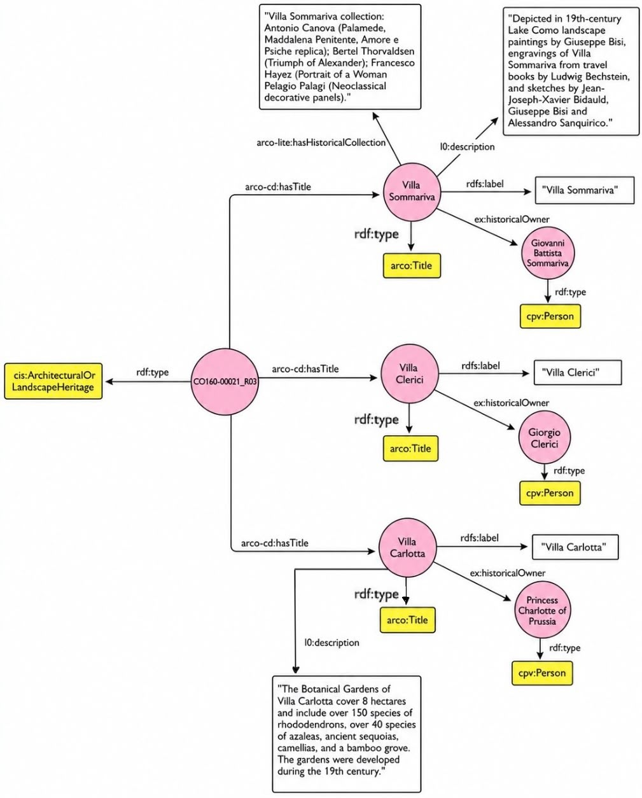

  <a href="index.html">⭐ Home</a>
  <a href="topic.html">⭐ Topic</a>
  <a href="methodology.html">⭐ Methodology</a>
  <a href="sparql.html">⭐ SPARQL & Results</a>
  <a href="gaps.html">⭐ Identifying Gaps</a>
  <a href="prompts.html">⭐ LLM Prompts</a>
  <a href="rdf.html">⭐ RDF Triples</a>
  <a href="challenges.html">⭐ Challenges</a>

# Conclusion

Our project on
[**Villa Carlotta**](https://w3id.org/arco/resource/Lombardia/ArchitecturalOrLandscapeHeritage/CO160-00021_R03)
let us explore the potential — and the limits — of combining semantic web technologies with large language models to
enrich Italian cultural heritage data. Here are our main takeaways.

---

### SPARQL and the ArCo Ontology

[ArCo](http://wit.istc.cnr.it/arco/?lang=en) and SPARQL proved to be powerful tools for exploring structured data
about Villa Carlotta. We learned that:

- Villa Carlotta **is** represented in ArCo, classified as `ArchitecturalOrLandscapeHeritage`, with 11 related IRIs
  found through label search alone.
- Searching under its **historical name "Villa Sommariva"** unlocked over three times as many related entities (37
  vs. 11) — a strong reminder that **naming conventions matter** when querying a knowledge graph.
- Despite this richness, ArCo currently has **no links** between Villa Carlotta and its historical owners, its art
  collection, or its botanical garden — and no explicit connection between its three historical names.

---

### Large Language Models

We compared four LLMs — [Copilot](https://copilot.microsoft.com/), [ChatGPT](https://chat.openai.com/),
[Gemini](https://gemini.google.com/) and [Claude AI](https://claude.ai/) — across five different enrichment tasks:

- **Copilot** and **ChatGPT** tended to play it safe, summarizing missing information into a single descriptive
  literal (`arco-core:description` / `l0:description`).
- **ChatGPT** stood out for proposing **new, more granular predicates** and, in particular, for the **"Title
  resource" pattern** that successfully connected Villa Carlotta's three historical names with six clean triples. It
  was also the most consistently reliable model overall, producing valid queries and triples across every prompt.
- **Gemini** often returned "no results" when its queries were tested live, but produced by far the **most detailed
  and structured** set of triples for linking artworks that depict the villa — modeling each artwork and author as
  its own entity. It was also the most prone to hallucination, regressing to invalid output in our final prompt.
- **Copilot** struggled with empty results in the first three prompts, but gradually adapted and produced valid
  triples by the fourth and fifth — showing it can improve within a single session as it picks up context.
- **Claude AI** was not used to generate SPARQL or RDF directly; instead, it acted as an independent fact-checking
  layer, consistently confirming the historical owners, art collection and the equivalence of the villa's three
  names with concise, accurate summaries.
- Overall, **few-shot** and **chain-of-thought** prompts produced noticeably more structured and reusable triples
  than plain **zero-shot** prompts.

This confirms that **no single LLM is best for every task** — combining their outputs, and choosing prompting
techniques deliberately, gave us the richest results. See the [LLM Prompts](prompts.html) and
[Challenges](challenges.html) pages for the full breakdown.

---

  <a href="challenges.html">← Previous</a>

