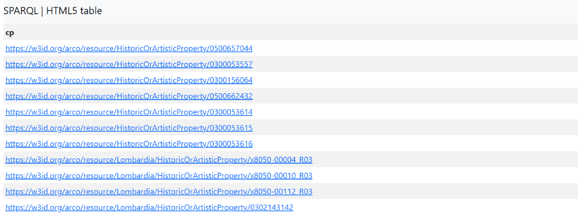
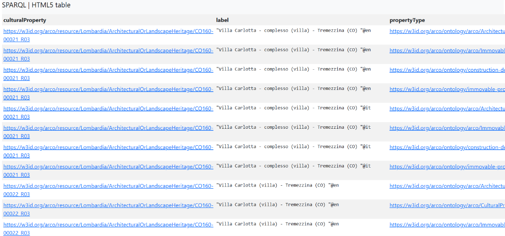
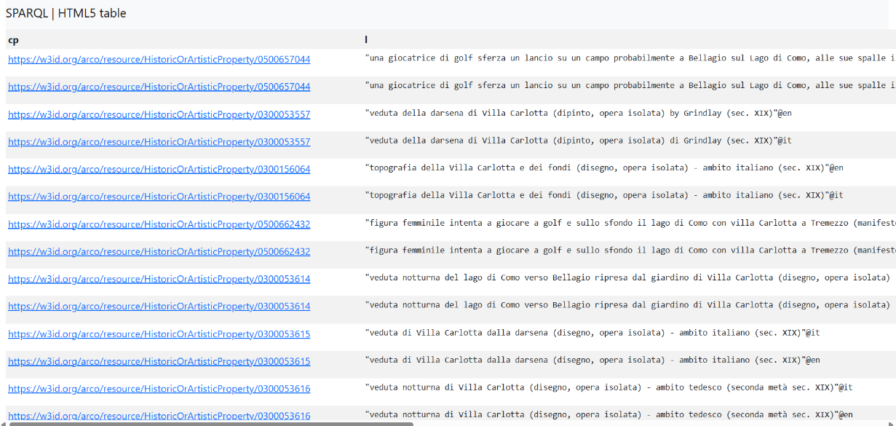
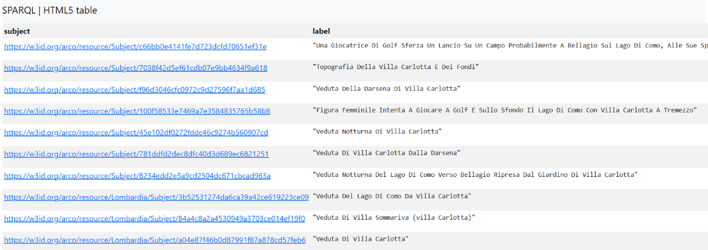

<div class="site-nav">
  <a href="index.html">⭐ Home</a>
  <a href="topic.html">⭐ Topic</a>
  <a href="methodology.html">⭐ Methodology</a>
  <a href="gaps.html">⭐ Identifying Gaps</a>
  <a href="prompts.html">⭐ LLM Prompts</a>
  <a href="rdf.html">⭐ RDF Triples</a>
  <a href="challenges.html">⭐ Challenges</a>
  <a href="conclusion.html">⭐ Conclusion</a>
</div>

# SPARQL Queries & Results


Here are the SPARQL queries we used to research [**Villa Carlotta**](https://www.villacarlotta.it/en/) in
[**ArCo**](http://wit.istc.cnr.it/arco/). We focused on general information, visual materials, alternative names,
and connections to related entities such as gardens and historical owners.

To explore ArCo, we first studied the [ArCo ontology](http://wit.istc.cnr.it/arco/lode/extract?lang=en&url=https://raw.githubusercontent.com/ICCD-MiBACT/ArCo/master/ArCo-release/ontologie/arco/arco.owl).

### SPARQL keywords used in this page

- **`DISTINCT`** — eliminates duplicate results
- **`OPTIONAL`** — represents data that may or may not exist
- **`UNION`** — combines the results of two or more graph patterns
- **`FILTER`** + **`REGEX`** — restricts results by matching patterns inside string values
- **`LIMIT`** — returns only a specific number of results
- **`ORDER BY`** — orders the results by a given field
- **`BIND`** — assigns a value to a new custom variable on the fly
- **`*`** — retrieves all available variables for each match

### Other useful namespace prefixes

- `rdfs:` — RDF Schema
- `cp:` — Cultural Property
- `foaf:` — Friend of a Friend
- `arco:` — ArCo Core Ontology
- `a-cd:` — Context Description

---

## Query 1 — Does ArCo contain information on our topic?

The first step was to verify whether the ArCo Knowledge Graph already contains an entity representing our selected
topic, **Villa Carlotta**.

```sparql
PREFIX rdf: <http://www.w3.org/1999/02/22-rdf-syntax-ns#>
PREFIX rdfs: <http://www.w3.org/2000/01/rdf-schema#>
PREFIX arco: <https://w3id.org/arco/ontology/arco/>

SELECT DISTINCT ?cp
WHERE {
    ?cp a arco:HistoricOrArtisticProperty ;
        rdfs:label ?l .
    FILTER(REGEX(?l, "Villa Carlotta", "i"))
}
```

### Results

The query returned **11 distinct IRIs** typed as `arco:HistoricOrArtisticProperty`. This confirms that ArCo already
holds records of the physical property, and gives us the exact subject IRIs we may need for future enrichment.



### IRIs found

- [HistoricOrArtisticProperty/0500657044](https://w3id.org/arco/resource/HistoricOrArtisticProperty/0500657044)
- [HistoricOrArtisticProperty/0300053557](https://w3id.org/arco/resource/HistoricOrArtisticProperty/0300053557)
- [HistoricOrArtisticProperty/0300156064](https://w3id.org/arco/resource/HistoricOrArtisticProperty/0300156064)
- [HistoricOrArtisticProperty/0500662432](https://w3id.org/arco/resource/HistoricOrArtisticProperty/0500662432)
- [HistoricOrArtisticProperty/0300053614](https://w3id.org/arco/resource/HistoricOrArtisticProperty/0300053614)
- [HistoricOrArtisticProperty/0300053615](https://w3id.org/arco/resource/HistoricOrArtisticProperty/0300053615)
- [HistoricOrArtisticProperty/0300053616](https://w3id.org/arco/resource/HistoricOrArtisticProperty/0300053616)
- [Lombardia/HistoricOrArtisticProperty/x8050-00004_R03](https://w3id.org/arco/resource/Lombardia/HistoricOrArtisticProperty/x8050-00004_R03)
- [Lombardia/HistoricOrArtisticProperty/x8050-00010_R03](https://w3id.org/arco/resource/Lombardia/HistoricOrArtisticProperty/x8050-00010_R03)
- [Lombardia/HistoricOrArtisticProperty/x8050-00112_R03](https://w3id.org/arco/resource/Lombardia/HistoricOrArtisticProperty/x8050-00112_R03)
- [Lombardia/HistoricOrArtisticProperty/0302143142](https://w3id.org/arco/resource/Lombardia/HistoricOrArtisticProperty/0302143142)

---

## Query 2 — Villa Carlotta as an Immovable Cultural Property

We wanted to find out if there is connection in ArCo system for Villa Carlotta as Immovable cultural property

### Keywords used
- **`OPTIONAL`** — fetches the more precise subclass (e.g. "Architectural or Landscape Heritage") only if it exists
- **`FILTER(regex(...))`** — case-insensitive match on the label

```sparql
PREFIX rdf: <http://www.w3.org/1999/02/22-rdf-syntax-ns#>
PREFIX rdfs: <http://www.w3.org/2000/01/rdf-schema#>
PREFIX arco: <https://w3id.org/arco/ontology/arco/>
PREFIX core: <https://w3id.org/arco/ontology/core/>

SELECT DISTINCT ?culturalProperty ?label ?propertyType
WHERE {
  ?culturalProperty rdf:type arco:ImmovableCulturalProperty .
  ?culturalProperty rdfs:label ?label .
  OPTIONAL { ?culturalProperty rdf:type ?propertyType . }
  FILTER (regex(str(?label), "Villa Carlotta", "i"))
}
LIMIT 50
```

### Results

We found that Villa Carlotta belongs to the class **`ArchitecturalOrLandscapeHeritage`**. This will be very useful
for the enrichment part later.



### IRIs found

- [Lombardia/ArchitecturalOrLandscapeHeritage/CO160-00021_R03](https://w3id.org/arco/resource/Lombardia/ArchitecturalOrLandscapeHeritage/CO160-00021_R03) — our main IRI for Villa Carlotta
- [Lombardia/ArchitecturalOrLandscapeHeritage/CO160-00022_R03](https://w3id.org/arco/resource/Lombardia/ArchitecturalOrLandscapeHeritage/CO160-00022_R03)

---

## Query 3 — Finding depictions of Villa Carlotta

In this query, we aimed to find **visual representations** (images) of Villa Carlotta.

### Keywords used
- **`OPTIONAL`** — includes a depiction only if it is available
- **`*`** — retrieves all available variables for each match
- Two **`FILTER(REGEX)`** — narrow down results using both "Villa" and "Carlotta"

```sparql
PREFIX rdf: <http://www.w3.org/1999/02/22-rdf-syntax-ns#>
PREFIX arco: <https://w3id.org/arco/ontology/arco/>
PREFIX foaf: <http://xmlns.com/foaf/0.1/>

SELECT *
WHERE {
    ?cp a arco:HistoricOrArtisticProperty ;
        rdfs:label ?l .
    FILTER(REGEX(?l, "Villa", "i"))
    FILTER(REGEX(?l, "Carlotta", "i"))
    OPTIONAL { ?cp foaf:depiction ?depiction }
}
```

### Results

The query returned the same IRIs found in Query 1, this time including their depictions.



---

## Query 4 — Does ArCo know Villa Carlotta by its historic name "Villa Clerici"?

Villa Carlotta was originally built for the Clerici family and was therefore once known as "Villa Clerici". We wanted
to verify whether ArCo contains an entity under this historic name.

```sparql
PREFIX rdf: <http://www.w3.org/1999/02/22-rdf-syntax-ns#>
PREFIX arco: <https://w3id.org/arco/ontology/arco/>

SELECT DISTINCT ?cp
WHERE {
    ?cp a arco:HistoricOrArtisticProperty ;
        rdfs:label ?l .
    FILTER(REGEX(?l, "Villa Clerici", "i"))
}
```

### Results

**Negative result** — the query confirmed that ArCo does **not** contain any entity labeled "Villa Clerici". This is
our first hint of a possible knowledge gap around the villa's historic names.

---

## Query 5 — Identifying subjects related to Villa Carlotta

This query looks for distinct resources categorized as **Subjects** in the ArCo context-description ontology, whose
labels contain both "Villa" and "Carlotta". The goal was to surface more nuanced references to the villa.

```sparql
PREFIX a-cd: <https://w3id.org/arco/ontology/context-description/>
PREFIX rdfs: <http://www.w3.org/2000/01/rdf-schema#>

SELECT DISTINCT ?subject ?label
WHERE {
  ?subject a a-cd:Subject ;
           rdfs:label ?label .

  FILTER (REGEX(?label, "Villa", "i"))
  FILTER (REGEX(?label, "Carlotta", "i"))
}
```

### Results

This query found **10 new IRIs**. More importantly, it revealed key historical context: the villa is also referred to
as **"Villa Sommariva"** (named after a famous past owner, Giovanni Battista Sommariva), and it surfaced mentions of
its famous gardens (**"Giardini"**).



### IRIs found

- [Subject/c66bb0e4141fe7d723dcfd70651ef31e](https://w3id.org/arco/resource/Subject/c66bb0e4141fe7d723dcfd70651ef31e)
- [Subject/7038f42d5ef61cdb07e9bb4634f9a618](https://w3id.org/arco/resource/Subject/7038f42d5ef61cdb07e9bb4634f9a618)
- [Subject/f96d3046cfc0972c9d27596f7aa1d685](https://w3id.org/arco/resource/Subject/f96d3046cfc0972c9d27596f7aa1d685)
- [Subject/100f58533e7469a7e3584835765b58b8](https://w3id.org/arco/resource/Subject/100f58533e7469a7e3584835765b58b8)
- [Subject/45e102df0272fddc46c9274b560907cd](https://w3id.org/arco/resource/Subject/45e102df0272fddc46c9274b560907cd)
- [Subject/781ddfd2dec8dfc40d3d689ec6821251](https://w3id.org/arco/resource/Subject/781ddfd2dec8dfc40d3d689ec6821251)
- [Subject/8234edd2e5a9cd2504dc671cbcad963a](https://w3id.org/arco/resource/Subject/8234edd2e5a9cd2504dc671cbcad963a)
- [Lombardia/Subject/3b52531274da6ca39a42ce619223ce09](https://w3id.org/arco/resource/Lombardia/Subject/3b52531274da6ca39a42ce619223ce09)
- [Lombardia/Subject/84a4c8a2a4530949a3703ce014ef19f0](https://w3id.org/arco/resource/Lombardia/Subject/84a4c8a2a4530949a3703ce014ef19f0)
- [Lombardia/Subject/a04e87f46b0d87991f87a878cd57feb6](https://w3id.org/arco/resource/Lombardia/Subject/a04e87f46b0d87991f87a878cd57feb6)

---

## Query 6 — Investigating the historic name "Villa Sommariva"
<a id="query6"></a>

To pull everything together for **"Villa Sommariva"**, we created a query that scans **both** classes
(`arco:HistoricOrArtisticProperty` and `a-cd:Subject`) in a single pass, using `UNION`.

### Keywords used
- **`UNION`** — combines two patterns: one over Properties, one over Subjects
- **`BIND`** — labels each result with its origin ("Property" or "Subject")
- **`ORDER BY`** — sorts the results by type and label

```sparql
PREFIX rdfs: <http://www.w3.org/2000/01/rdf-schema#>
PREFIX arco: <https://w3id.org/arco/ontology/arco/>
PREFIX a-cd: <https://w3id.org/arco/ontology/context-description/>

SELECT DISTINCT ?entity ?type ?label
WHERE {
  {
    ?entity a arco:HistoricOrArtisticProperty ;
            rdfs:label ?label .
    BIND("Property" AS ?type)
  }
  UNION
  {
    ?entity a a-cd:Subject ;
            rdfs:label ?label .
    BIND("Subject" AS ?type)
  }

  FILTER(REGEX(?label, "Sommariva", "i"))
}
ORDER BY ?type ?label
```

### Results

The query returned **37 result rows**, coming from these **22 unique IRIs** connected to the name "Villa Sommariva":


**Properties (`arco:HistoricOrArtisticProperty`)**

- Lombardia/HistoricOrArtisticProperty/2p010-01156_R03
- Lombardia/HistoricOrArtisticProperty/2p010-01109_R03
- Lombardia/HistoricOrArtisticProperty/x8050-00012_R03
- Lombardia/HistoricOrArtisticProperty/x8050-00006_R03
- Lombardia/HistoricOrArtisticProperty/x8050-00004_R03
- Lombardia/HistoricOrArtisticProperty/2p010-01046_R03
- Lombardia/HistoricOrArtisticProperty/2p010-01113_R03
- Lombardia/HistoricOrArtisticProperty/2p010-01062_R03
- Lombardia/HistoricOrArtisticProperty/2p010-01138_R03
- Lombardia/HistoricOrArtisticProperty/2p010-01129_R03
- Lombardia/HistoricOrArtisticProperty/2p010-01120_R03
- Lombardia/HistoricOrArtisticProperty/2p010-01070_R03
- Lombardia/HistoricOrArtisticProperty/2p010-00985_R03
- HistoricOrArtisticProperty/0300053454
- HistoricOrArtisticProperty/0300053451

**Subjects (`a-cd:Subject`)**

- Lombardia/Subject/486d95ca06854c2a9758f9db063b633c
- Lombardia/Subject/d274280888494b52673c3ac11482387b
- Lombardia/Subject/b1600804528f75f0d6807924649e9185
- Subject/83b1d1ad4477648788b0223535d0b866
- Subject/ae8f32b731c040a5ed5e13c9c4c1704e
- Lombardia/Subject/dc67ed427032e899a6fb285e98255120
- Lombardia/Subject/84a4c8a2a4530949a3703ce014ef19f0

---

## Breakthrough Analysis

### 1. A significant data expansion

By shifting our focus to the historical name **"Villa Sommariva"**, the available entity pool expanded dramatically:

| Query | Search term | Results |
|---|---|---|
| Query 1 | "Villa Carlotta" | 11 unique properties |
| Query 6 | "Villa Sommariva" | 37 result rows (22 unique entities) |

This means there is a wealth of archival data, art objects, and architectural components cataloged under the old
Napoleonic-era name "Villa Sommariva" that a user searching only for "Villa Carlotta" would completely miss.

### 2. A cross-over entity

We cross-referenced this new list with Query 1 and found one anchor entity — a node that bridges the past and present
names:

> [Lombardia/HistoricOrArtisticProperty/x8050-00004_R03](https://w3id.org/arco/resource/Lombardia/HistoricOrArtisticProperty/x8050-00004_R03)

This exact IRI appears in **both Query 1 and Query 5/6**, which tells us that this specific property record is
explicitly labeled with both names (e.g. *"Villa Carlotta, già Villa Sommariva"*), making it a perfect pivot point for
data integration.

### A full discussion of what is missing is available on the [Identifying Gaps](gaps.html) page.

<hr>
<div class="page-footer-nav">
  <a href="methodology.html">← Previous</a>
  <a href="gaps.html">Next →</a>
</div>
