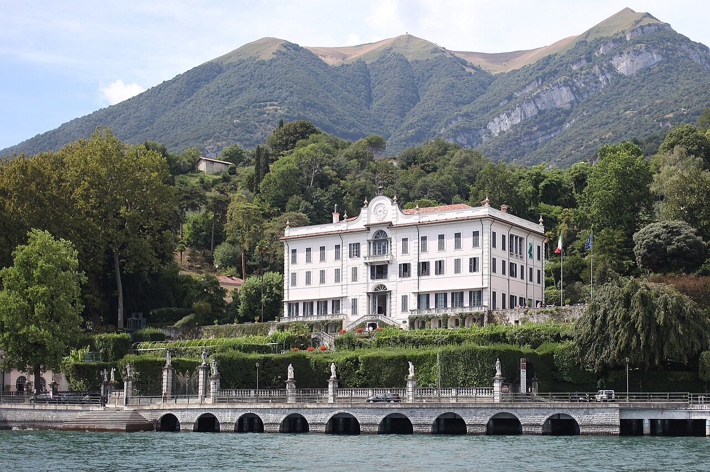

  <a href="index.html">⭐ Home</a>
  <a href="methodology.html">⭐ Methodology</a>
  <a href="sparql.html">⭐ SPARQL & Results</a>
  <a href="gaps.html">⭐ Identifying Gaps</a>
  <a href="prompts.html">⭐ LLM Prompts</a>
  <a href="rdf.html">⭐ RDF Triples</a>
  <a href="challenges.html">⭐ Challenges</a>
  <a href="conclusion.html">⭐ Conclusion</a>

# Villa Carlotta
_A Neoclassical museum and botanical garden on Lake Como_

## Why Villa Carlotta?

As shown on the [official website](https://www.villacarlotta.it/en/), Villa Carlotta was built at the end of the
seventeenth century by the marquises Clerici of Milan and tells the story of over three centuries of great art
collections. Every year it also opens the gates of its fascinating botanical garden, which draws thousands of
visitors from all over the world.

We selected Villa Carlotta for this project because:

- It is one of the most visited historic houses on **Lake Como**, with a rich timeline of owners, art collections and gardens
- It is **still an active cultural venue today**, hosting exhibitions, concerts, ballets and publications — a perfect match for our interest in **international event management**
- Its layered history (Clerici → Sommariva → Princess Charlotte of Prussia) gives us several **alternative names and owners** to investigate in the knowledge graph

## Our Hypothesis

Our hypothesis is that the **[ArCo](http://wit.istc.cnr.it/arco/)** knowledge graph will contain information about the
**ancient building and its historical background**, but will **not** include information about its current use as an
**international event and exhibition venue**, nor about its owners, art collection or botanical garden.

---

## Objectives

- To explore the **ArCo ontologies** using the official [SPARQL endpoint](https://dati.cultura.gov.it/sparql) in order
  to extract relevant and meaningful information about Villa Carlotta
- To use **Large Language Models (LLMs)** — Google Gemini, Claude AI, ChatGPT and Copilot — to produce new knowledge and
  propose **RDF triples** that could enrich the ArCo Knowledge Graph
- To **compare these LLMs** with each other, so that we can choose the best option for future projects

  <a href="index.html">← Previous</a>
  <a href="methodology.html">Next →</a>

